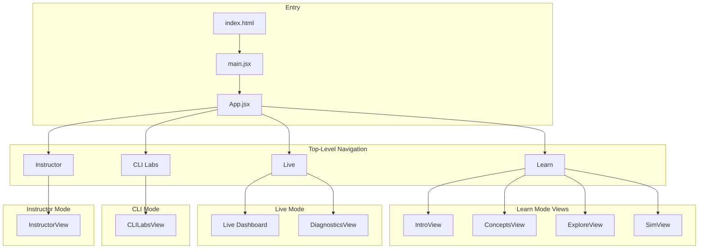
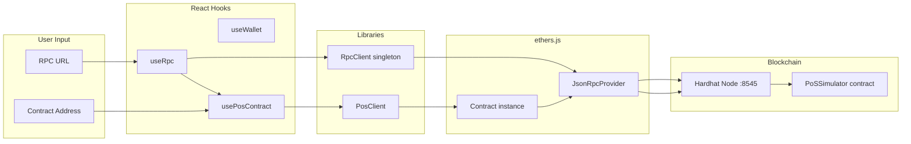
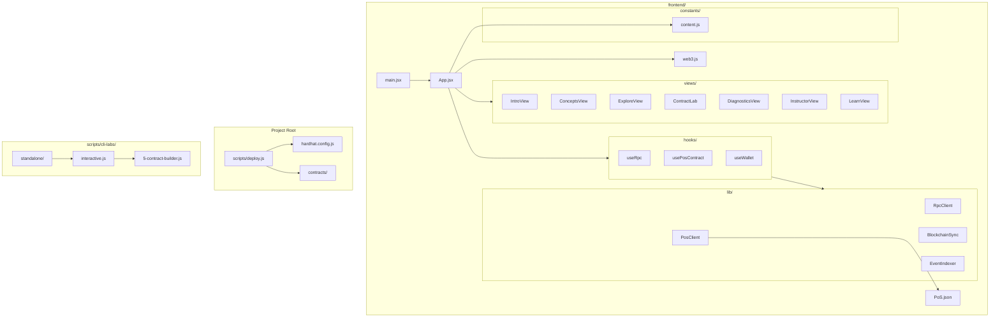
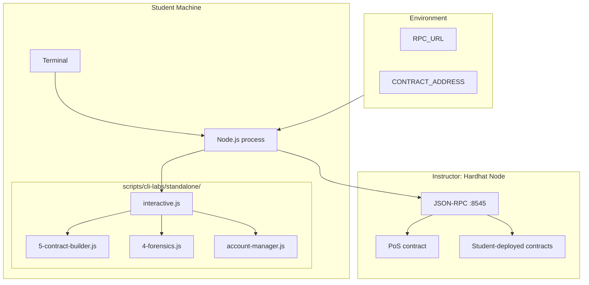
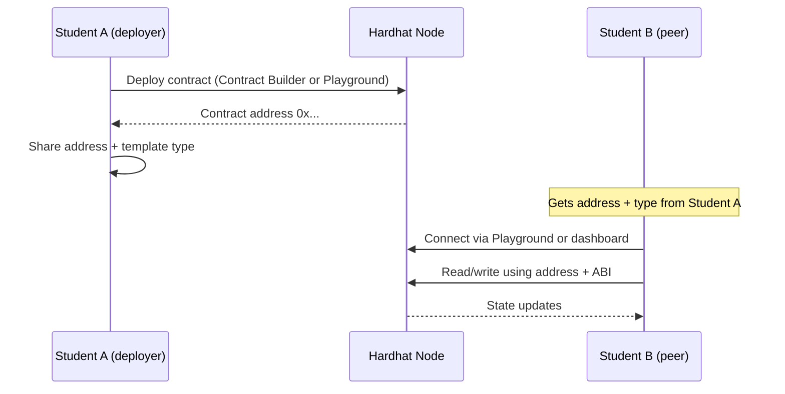
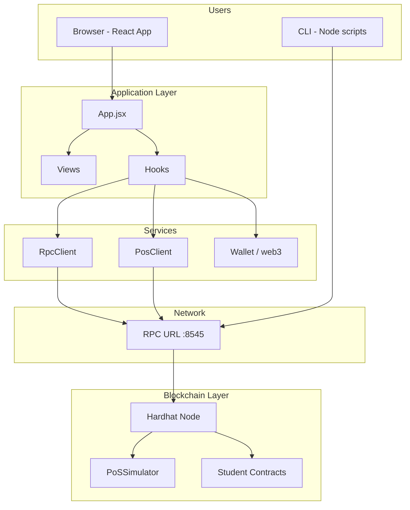

# Ethereum Lab — System Architecture

This document describes how the Ethereum Immersive Trainer is connected: frontend, blockchain node, smart contracts, and CLI tools.

---

## 1. High-Level Overview

```
┌─────────────────────────────────────────────────────────────────────────────┐
│                           INSTRUCTOR MACHINE                                  │
│  ┌─────────────────┐    ┌──────────────────┐    ┌─────────────────────────┐ │
│  │  Hardhat Node   │    │  Smart Contracts │    │  Frontend (Vite/React)  │ │
│  │  port 8545      │◄──►│  PoS, Lock, etc. │◄──►│  port 5173             │ │
│  │  (blockchain)   │    │  deployed on node│    │  (web UI)               │ │
│  └────────┬────────┘    └──────────────────┘    └───────────┬─────────────┘ │
│           │                                                  │               │
└───────────┼──────────────────────────────────────────────────┼───────────────┘
            │ JSON-RPC (HTTP)                                   │ HTTP
            │                                                   │
┌───────────┼──────────────────────────────────────────────────┼───────────────┐
│           │              STUDENT MACHINES                    │               │
│  ┌────────▼────────┐                              ┌──────────▼──────────────┐ │
│  │  CLI Labs       │  (optional)                  │  Browser                │ │
│  │  npm start      │  Connects to instructor RPC  │  Opens instructor URL    │ │
│  │  Playground,    │  Same chain, same contracts │  or localhost:5173       │ │
│  │  Contract Builder│                             │  Enters RPC + contract   │ │
│  └─────────────────┘                              └─────────────────────────┘ │
└───────────────────────────────────────────────────────────────────────────────┘
```

- **Instructor** runs the blockchain node and (optionally) the frontend. Students use the same RPC URL and contract address.
- **Lab API** (port 3000): session check (instructor IP restriction), fund requests, wallet-creation tracking per IP. Only the instructor’s IP can access `?mode=instructor`.
- **Students** either open the instructor’s frontend URL or run the frontend locally and point it at the instructor’s RPC and contract address. New students (by IP) must create a wallet first; they can click **Request funds** to notify the instructor.
- **CLI Labs** (optional) run on student machines and connect to the same RPC (and contracts) via environment variables.

---

## 2. Frontend Application Structure



| Mode      | Main views / content |
|-----------|------------------------|
| **Learn** | Orientation → Basics (concepts) → Explore (forensics missions) → Practice (simulator) |
| **Live**  | Staking UI, chat, validators; Diagnostics for connection checks |
| **CLI**   | Single long page: Quick Start, Menu Options, Playground, Deploy & Share, Build Contract, Forensics, etc. (with search) |
| **Instructor** | Dashboard: fund students, slash, advance epochs, monitor activity |

---

## 3. Data Flow: RPC and Contract Connection



- **RpcClient** (in `frontend/src/lib/RpcClient.js`): single shared provider for the app; created when the user sets the RPC URL.
- **PosClient** (in `frontend/src/lib/PosClient.js`): wraps the PoS contract (ABI from `PoS.json`); created when provider + contract address are set.
- **useRpc**: manages RPC URL state and exposes `provider` and connection status.
- **usePosContract**: uses `provider` and contract address to create `PosClient`, then exposes messages, validators, staking, and methods like `stake()`, `sendMessage()`.
- **useWallet**: manages the in-browser wallet (generate/import, signer for transactions).

So: **User enters RPC URL and contract address → useRpc/usePosContract → RpcClient/PosClient → ethers Provider/Contract → Hardhat node and PoS contract.**

---

## 4. File and Module Map



- **App.jsx**: holds navigation state (`view`), renders sidebar and the four modes (Learn, Live, CLI, Instructor), and embeds CLILabsView (searchable CLI guides).
- **content.js**: static copy for concepts, missions, lessons (used by Intro/Concepts/Explore/Learn).
- **web3.js**: wallet helpers (connect, import, generate, etc.) and any legacy wiring.
- **contracts/**: Solidity sources; `contracts/student/` holds template-generated and custom student contracts. Deployment writes to `contracts/student/deployments.json` and artifacts under `artifacts/`.

---

## 5. CLI Labs and Blockchain



- Students run `npm start` (or `node interactive.js`) from `scripts/cli-labs/standalone/` after setting `RPC_URL` and optionally `CONTRACT_ADDRESS`.
- **interactive.js**: menu (network info, blocks, accounts, tx lookup, send ETH, contract interaction, **Playground**, **Contract Builder**, Account Manager). Playground has `loadArtifact`, `deploy()`, `fs`, and ethers.
- **5-contract-builder.js**: template-based Solidity generation → save to `contracts/student/` → Hardhat compile → deploy via ethers; writes to `deployments.json`.
- **4-forensics.js**: guided forensics (address, tx, block, events, money flow).
- **account-manager.js**: generate/import wallets, fund (instructor), list students.

All of these talk to the **same** instructor node and contracts once RPC (and contract address for PoS) are set.

---

## 6. Contract Deployment and Sharing



- **Deployer (e.g. Student A)**: Uses Contract Builder (option 9) or Playground `deploy()`; gets back contract address. Shares **address** and **template type** (or ABI).
- **Others (e.g. Student B)**: Enter same RPC URL and contract address in Playground or dashboard; use ABI (from template or `loadArtifact`) to call view/write/payable functions. All use the same node, so they see the same state.

---

## 7. Build and Run Commands

| Action | Command | Where |
|--------|--------|--------|
| Start blockchain | `npm run chain` | Project root |
| Deploy PoS + Lock | `npm run deploy` | Project root (after chain is running) |
| Start web UI | `npm run web` or `cd frontend && npm run dev -- --host` | Root or frontend |
| Full lab (instructor) | `.\start-lab.ps1 -Mode instructor` | Windows, project root |
| Student CLI | `cd scripts/cli-labs/standalone && npm start` | After setting RPC_URL (and CONTRACT_ADDRESS for PoS) |
| Compile Solidity | `npx hardhat compile` | Project root |
| Student contract deploy | In Playground: `deploy('student/MyContract.sol/MyContract', ...args)` | After compile |

---

## 8. Summary Diagram



**In one sentence:** The React app and CLI labs both connect to the same Hardhat node via RPC; the app uses RpcClient and PosClient (and wallet) to read/write the PoS and other contracts, and students can deploy and share their own contracts on the same chain.

---

*Document generated for the Ethereum Immersive Trainer. Update this file when you add new views, hooks, or deployment paths.*
